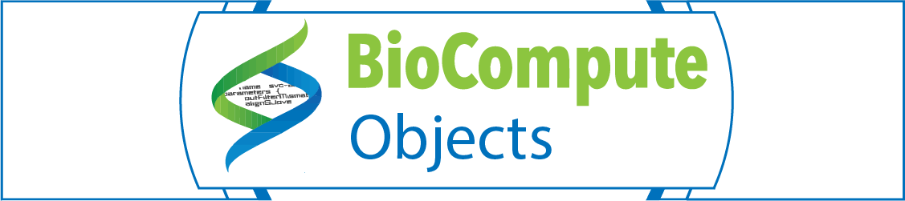

  

The FDA has announced support for the use in regulatory submissions the current version of the IEEE BioCompute standard (available at https://standards.ieee.org/standard/2791-2020.html) and an update to include this standard in the FDA Data Standards Catalog for the submission of HTS data in NDAs,ANDAs, BLAs, and INDs to CBER, CDER, and CFSAN. More information [here](https://www.govinfo.gov/content/pkg/FR-2020-07-22/pdf/2020-15907.pdf).

 

BioCompute is a [standardized](https://standards.ieee.org/content/ieee-standards/en/standard/2791-2020.html) way to communicate an analysis pipeline. BioCompute substantially improves the clarity and reproducibility of an analysis, and can be packaged with other standards, such as the [Common Workflow Language](https://www.commonwl.org/). An analysis that is reported in a way that conforms to the BioCompute specification is called a BioCompute Object (BCO). A BCO provides the structure that dictates what information must be present in a report.

The main citations for BioCompute are: [Biocompute Objects-A Step towards Evaluation and Validation of Biomedical Scientific Computations](https://pubmed.ncbi.nlm.nih.gov/27974626/) and [Enabling precision medicine via standard communication of HTS provenance, analysis, and results](https://pubmed.ncbi.nlm.nih.gov/30596645/).

The open source repository for the IEEE Standard can be accessed [here](https://opensource.ieee.org/2791-object/ieee-2791-schema). Several tools have been developed to read or write an analysis as a BCO. Other resources can be found [here](/resources).

 

### [Join our Community!](https://www.biocomputeobject.org/ppp/)

 

### Cloud-based tools for working with BioCompute

See our [resources](/resources) page for additional tools and services.

 

 

Access AWS HIVE, the High-Performance Integrated Virtual Environment, on AWS. HIVE is a cloud-based environment optimized for the storage and analysis of extra-large data, such as biomedical data, clinical data, next-generation sequencing (NGS) data, mass spectrometry files, confocal microscopy images, post-market surveillance data, medical recall data, and many others.

 

 

Use the BCO Portal on AWS, a platform-free, form-based editor. The portal walks a user through building a BCO through drop down menus and text boxes, indicating which entries are required to adhere to the IEEE standard.

 

 

Use Galaxy on AWS, the open source, web-based platform for data intensive biomedical research. Assemble your [pipeline](/about) in the workspace, designate the outputs in the module boxes, and record the entire pipeline as a BCO.

NOTE: Computation and storage on the AWS servers are free, but data egress will have a cost associated with it (approximately $100/TB). After registering, we ask that you send your name, institution and a brief 3 sentence description about the project you'll work on to keeneyjg@gwu.edu.

